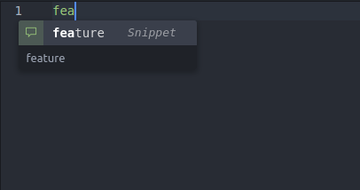
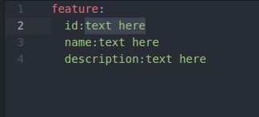

# Atom Selenium Autocomplete

Its an atom plug to autocomplete couple of keys in yaml based test case files

Download it from [https://atom.io/packages/atom-selenium-autocomplete](https://atom.io/packages/atom-selenium-autocomplete)

## Usage

## Credits

thanks to [atom-autocomplete-boilerplate](https://github.com/lonekorean/atom-autocomplete-boilerplate)

